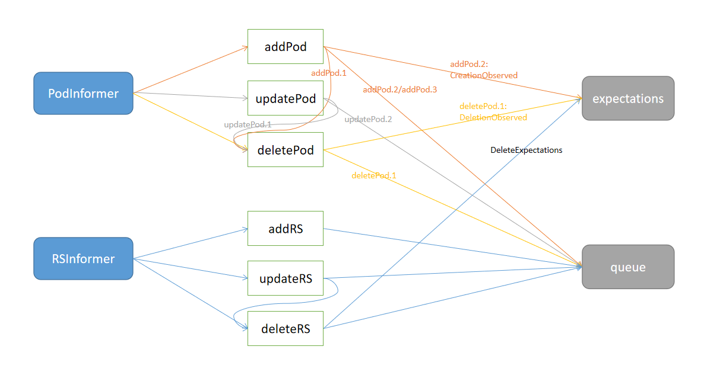

# ReplicaSet and Replication

现下，Deployment算是k8s中使用最广泛的控制器，而ReplicaSet和Replication我们一般不会直接用到，但也值得研究下它们的实现。

在Deployment出现前，Replication往往是部署无状态应用（无论单副本还是多副本）的首选；而Deployment又工作在ReplicaSet之上，借助多个ReplicaSet来实现多版本控制。

> ReplicaSetController is responsible for synchronizing ReplicaSet objects stored in the system with actual running pods.

> ReplicationManager is responsible for synchronizing ReplicationController objects stored

本文的代码基于https://github.com/kubernetes/kubernetes/tree/release-1.18。

## ReplicaSet

### 入口

```golang
startReplicaSetController
    go replicaset.NewReplicaSetController(
        ctx.InformerFactory.Apps().V1().ReplicaSets(),
        ctx.InformerFactory.Core().V1().Pods(),
        ctx.ClientBuilder.ClientOrDie("replicaset-controller"),
        replicaset.BurstReplicas,
    ).Run(int(ctx.ComponentConfig.ReplicaSetController.ConcurrentRSSyncs), ctx.Stop)
```

从启动方法可以清楚，ReplicaSetController关注集群中的ReplicaSets和Pods。

### 结构体

```golang
type ReplicaSetController struct {
    schema.GroupVersionKind
    kubeClient clientset.Interface
    podControl controller.PodControlInterface
    burstReplicas int
    syncHandler func(rsKey string) error
    expectations *controller.UIDTrackingControllerExpectations
    rsLister appslisters.ReplicaSetLister
    rsListerSynced cache.InformerSynced
    podLister corelisters.PodLister
    podListerSynced cache.InformerSynced
    queue workqueue.RateLimitingInterface
}
```

1. `schema.GroupVersionKind`: group,version,kind
2. `kubeClient`: 用于和apiserver通信
3. `podControl`: 操作pod的接口，含CreatePods/CreatePodsOnNode/CreatePodsWithControllerRef/DeletePod/PatchPod等方法
4. `burstReplicas`: 调整ReplicaSet的Pods时，单次最大进行的Pod数量
5. `syncHandler`: 调谐方法
6. `expectations`: 存放针对各个rs 期望创建或删除的Pod个数（如果是删除，还会存放待删除Pod的key——namespace/name）
7. `rsLister`: 列出ReplicaSet的工具（从Informer中的Indexer中获取数据，不直接访问apiserver）
8. `rsListerSynced`: 初始时rsInformer通过ListerWatcher的list获取的所有ReplicaSet是否已经分发到EventHandler处理完毕
9. `podLister`: 列出Pod的工具（从Informer中的Indexer中获取数据，不直接访问apiserver）
10. `podListerSynced`: 初始时podInformer通过ListerWatcher的list获取的所有Pod是否已经分发到EventHandler处理完毕
11. `queue`: 限流的工作队列

### Informer与EventHandler

结构体存在两种Informer：PodInformer和ReplicaSetInformer。

这两个Informer注册的EventHandler如下图所示：



1. `addPod`: 分3种情况
    1. `pod.DeletionTimestamp != nil`该Pod已经处于pending deletion状态，直接调用deletePod
    2. 该Pod存在关联的Controller，且该Controller是已知的ReplicaSet，则调用CreateObserved（调低expectations中相应RS的期望创建Pod数）并将RS的key加入到queue中
    3. 该Pod不存在任何关联的Controller（这种情况下称该Pod是Orphan），但存在同一namespace内labelSelector与Pod的labels匹配的RS，将这些RS的key加入到queue中（后续Worker处理可以尝试将Pod与RS关联）
2. `updatePod`: 分2种情况
    1. `curPod.DeletionTimestamp != nil` 则调用deletePod删除curPod，如果oldPod与curPod的labels不相同，则也将oldPod删除
    2. 如果oldPod存在关联的ReplicaSet，则将该RS的key加入到queue中
        1. 如果当前curPod有关联的ReplicaSet，则将RS的key加入到queue中
        2. 如果当前curPod是Orphan，则依旧将labels匹配的RS的key加入到queue中
3. `deletePod`: 如果该Pod不是Orphan，则调用DeletionObserved（调低expectations中相应RS的期望删除Pod数）并将RS的key加入到queue中
4. `addRS`: 直接将该RS的key加入到queue中
5. `updateRS`: 如果`curRS.UID != oldRS.UID`，则调用deleteRS将oldRS删除；将curRS的key加入queue
6. `deleteRS`: 调用DeleteExpectations（由于RS本身不存在了，因此存于expectations中的期望创建或删除Pod数也就没意义了），将RS的key加入到queue中

### Worker

Worker的调谐逻辑见[syncReplicaSet](https://github.com/kubernetes/kubernetes/blob/a654bda3de8174c0a27b098c6f768ee8f47ffbe6/pkg/controller/replicaset/replica_set.go#L568)方法，它会从queue中拾取需要调谐的ReplicaSet（格式是namespace/name），然后分情况进行处理

1. ReplicaSet不存在，则直接从expectations中删除期望值即可
2. ReplicaSet存在，给labels匹配但没有ControllerRef的Pods指定Controller
3. ReplicaSet存在，判断当前activePods数量与ReplicaSet的Replicas否相等，不等则调用`manageReplicas`对ReplicaSet拥有的Pod数进行调整，最后更新ReplicaSet的状态
    1. `manageReplicas`时若activePods不足，则在expectations中设置期望创建的Pod数量，然后创建指定Controller的Pods
    2. `manageReplicas`时若activePods超过，则筛选出要删除的Pods，添加进expectations，之后删除这些Pods

在创建或删除Pods分别有一些策略：

#### 创建Pods策略

1. 一次`manageReplicas`创建的Pods数量不超过burstReplicas（默认是500）
2. 执行批量创建Pod时使用slowStartBatch（慢启动）策略：分批次创建，每次并发启动n个goroutine创建n个Pod，n从1开始指数增长（1->2->3->4->,,,），直到所有Pods创建完毕；但只要出现一个异常，就不再进行下一批次的创建

#### 删除Pods策略

1. 一次`manageReplicas`删除的Pods数量不超过burstReplicas（默认是500）
2. 选取最适合被删除的Pods。列出待删除Pods的候选项时，还会获取该ReplicaSet的Owner拥有的所有ReplicaSets关联的Pods（例如一个Deployment拥有两个ReplicaSet——a和b，则manageReplicas(a)时也将b的Pods考虑在内），用作Pods打分时的参考
3. 在给这些Pods打分时，使用下列策略（有优先级，只要一条符合就不再往下判断）：
    1. 根据是否被调度。没有被调度（NodeName为空）的Pod更适合被删除
    2. 根据Pod状态。Pending比Unknown更适合被删除，Unknown比Running更适合被删除
    3. 根据是否就绪。NotReady比Ready更适合被删除
    4. 根据所处节点上候选Pod数量（包含了同Owner的ReplicaSet的Pod）。Pod越多越适合被删除（例如ReplicaSet的Replicas为2，但当前节点a上有2个该ReplicaSet的Pod，而节点b上只有1个，那么a上的某个Pod更适合被删除）
    5. 根据就绪时间。当两个Pod都是Ready状态，晚Ready的更适合被删除
    6. 根据重启次数。重启次数越多，越适合被删除
    7. 根据创建时间。创建越晚，越适合被删除

## Replication

在本文对Controller进行分析的时候，Replication已与ReplicaSet完全无差别（除了名字），因为Replication的实现复用了ReplicaSet的源码。

```golang
// It is actually just a wrapper around ReplicaSetController.
type ReplicationManager struct {
    replicaset.ReplicaSetController
}
```

## 结语

ReplicaSet（RS）和Replication（RC）是k8s中非常经典的编排控制器，功能简单（维持应用副本数量），但它的实现上也体现了一些Controller技巧和思想：

1. 使用`slowStartBatch`来避免创建Pod时的拥塞。类比tcp发包时要考虑批量的报文进入网络可能产生的拥塞，创建Pod也要考虑k8s的承压能力；并发创建数量由小慢慢变大，可以提前发现问题。
2. 使用`expectations`记录(ExpectCreations/ExpectDeletions)期望创建或删除的资源量，再通过观察(CreationObserved/DeletionObserved)资源变化，将资源量的调整做成一个异步的、命令式的过程。
3. Pod所处StartUp阶段可以作为Pod竞争时衡量优先级的一个方面。