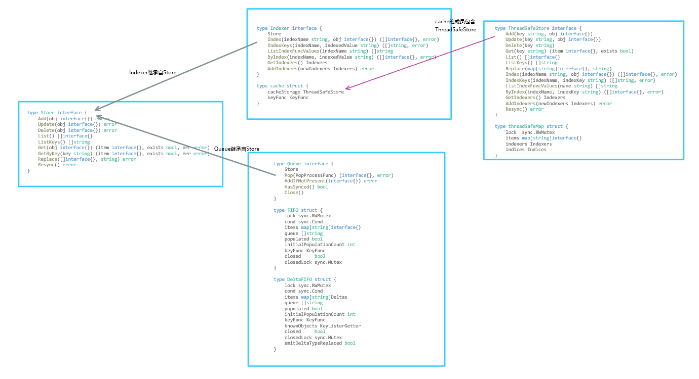
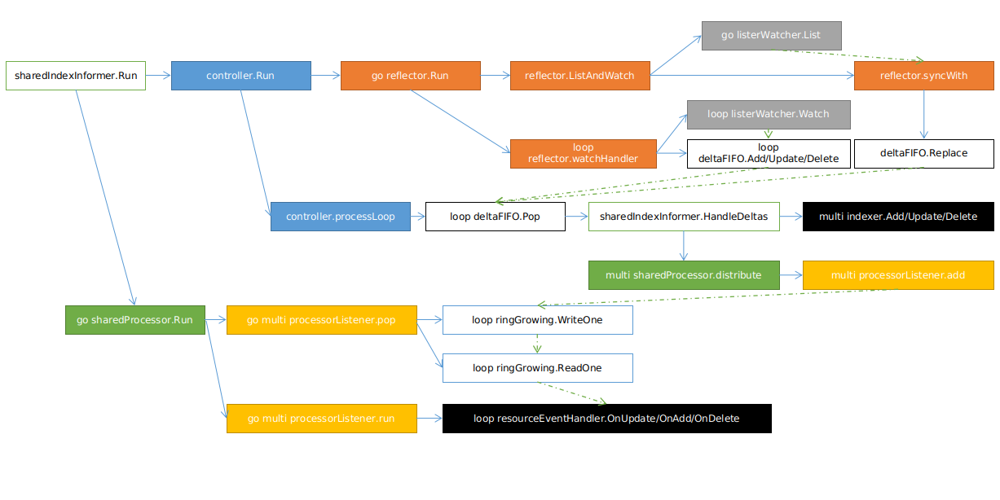
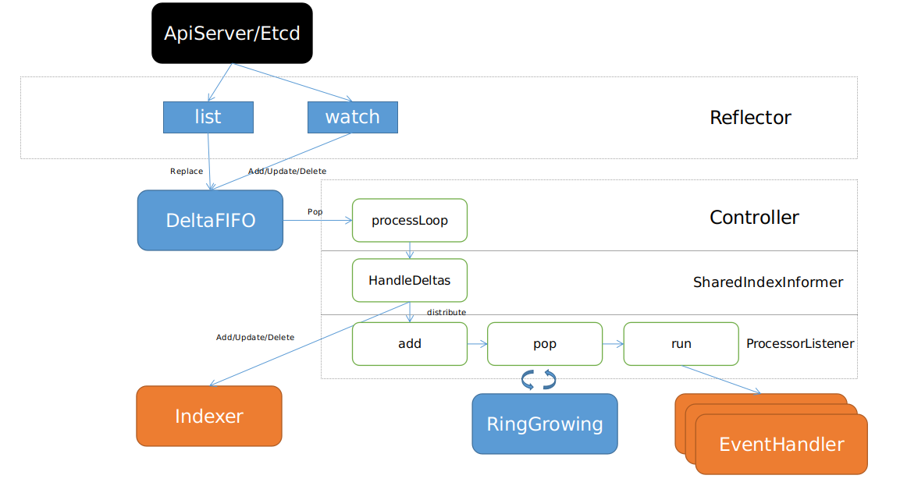

# SharedIndexInformer

SharedIndexInformer是k8s的client-go中一个功能强大的工具，通过它可以在client端缓存apiserver中的资源实例状态，以提高对整集群管理、调谐的效率。

无论在controller-manager/scheduler等原生组件中还是用kubebuilder编写crd的controller中都会用到它，因此对它内部的实现进行了解是很有必要的。

SharedIndexInformer的运行大致可以表述成：
1. 利用ListWatch机制不断从apiserver处获取某一类型的资源实例，存入本地内存中的一个Indexer（带索引和其他丰富接口的缓存）。
2. 并辅以一个Queue（按照先后顺序）对外进行通知（资源实例的变化——增删改 到来时触发用户事先自定义好的事件句柄）。
3. 一般情况下，触发的事件句柄会把资源变化事件放入一个workQueue，另有线程（可以有多个并行）从中拾取事件进行处理（基于本类型或其他类型资源的Indexer作出正确的决策）。当然这是后话，本文暂不具体展开。

下文以三个层次对SharedIndexInformer进行分析，分别是：
1. 静态：数据结构，出于利用索引提高读性能、顺序访问、线程安全、缓冲、阻塞等待等目的而实现，如Indexer、Queue、RingGrowing等
2. 动态：运行机制，创建、初始化、运行、运行时的各种goroutine被带起的时机
3. 动静结合：完整的数据处理流程，从访问apiserver获取资源到分发、处理、存储资源的整个流程

：如下文出现代码均以release-1.18分支为例。

## 数据结构

SharedIndexInformer，在cache包中提供了对应的实现sharedIndexInformer，其依赖一些自定义的特殊结构，先讲讲它们。

### Store

Store，一个通用的对象存储和处理的接口，可以简单理解成：以一个map为核心（存取数据），并提供丰富的接口方法（Add/Update/Delete/List/ListKeys/Get/GetByKey/Replace/Resync）。

Store在client-go/tools/cache库中并没有直接的实现，而是延伸出了两种新接口：Indexer和Queue，分别作为带索引的Store和维护处理顺序的Store。在具体业务逻辑中，这两者往往结合使用。

Store/Indexer/Queue的继承关系与实现的结构体如下图所示：



#### Indexer

实现Indexer的结构体是cache，而cache的核心在ThreadSafeStore（cache封装了ThreadSafeStore的相应方法，而Add/Update/Delete等方法实现上是先调用keyFunc获取对象的key再调用后者相应方法）。

keyFunc作用是计算某个对象的key，相同key的对象就可以确定是同一个对象实例的副本。由于底层数据存储的实现上是一个map，自然就可以用对象实例的新副本覆盖旧副本（或者如DeltaFIFO中那样保存不同版本）。

对于k8s的资源对象，普遍使用的keyFunc是MetaNamespaceKeyFunc，如对Pod就可以计算 `Pod的namespace/Pod的name` 作为key。


##### threadSafeMap

threadSafeMap实现了ThreadSafeStore，具体是如何实现的，有必要贴下其结构体。

```
type threadSafeMap struct {
	lock  sync.RWMutex
	items map[string]interface{}

	indexers Indexers
	indices Indices
}

type IndexFunc func(obj interface{}) ([]string, error)

type Index map[string]sets.String

type Indexers map[string]IndexFunc

type Indices map[string]Index
```

简单说明：
1. items作为存储对象key-value对的 核心结构
2. indexers存储一系列索引方法
3. indices存储通过将indexers中的索引方法作用在items上计算得出的索引key和索引values(此处有点绕，结合实例才方便理解)

举个例子：(模仿[nodeNameKeyIndex](https://github.com/kubernetes/kubernetes/blob/29e4e66b597e8fed0a41b77d99653941ae742103/pkg/controller/nodelifecycle/node_lifecycle_controller.go#L130:1)以nodename为索引)

假设此时items中含我们预设的Pod（精简了结构的），其key-value对如下所示：

```
"default/pod1" -> Pod{
    nodename: "node1"
}
"default/pod2" -> Pod{
    nodename: "node1"
}
```

同时该Indexer包含一个nodename索引，那么Indexers的key-value对如下所示：

```
"nodename" ->  nodeNameKeyIndex
```

nodeNameKeyIndex代码逻辑为：

```
func nodeNameKeyIndex(obj interface{}) ([]string, error) {
	pod, ok := obj.(*Pod)
	if !ok {
		return []string{}, nil
	}
	if pod.nodename == "" {
		return []string{}, nil
	}
	return []string{pod.nodename}, nil
}
```

那么最终indices的数据组织如下：

```
"nodename" -> {
    "node1" -> { "default/pod1", "default/pod2" }
}
```

##### Indexer的使用例子

代码放在[SharedIndexInformer/example/main.go](https://github.com/pangsq/read_code_of_k8s/blob/master/tools/cache/SharedIndexInformer/example/main.go)

```golang
type Resource struct {
	Namespace string
	Name      string
	Nodename  string
}

func assertEquals(obj, target interface{}) {
	if obj != target {
		panic(fmt.Sprintf("%v is not equal to %v", obj, target))
	}
}

// cache.MetaNamespaceKeyFunc是client-go中常用的keyFunc(计算object的key)，将`namespace/name`作为对象的唯一键
func metaNamespaceKeyFunc(obj interface{}) (string, error) {
	if res, ok := obj.(*Resource); ok {
		return res.Namespace + "/" + res.Name, nil
	}
	return "", errors.New("Wrong resource type")
}

func useIndexer() {
	metaNamespaceKeyFunc := func(obj interface{}) (string, error) {
		if res, ok := obj.(*Resource); ok {
			return res.Namespace + "/" + res.Name, nil
		}
		return "", errors.New("Wrong resource type")
	}
	// 以nodename为键的索引
	indexByNodename := func(obj interface{}) ([]string, error) {
		res := obj.(*Resource)
		nodename := res.Nodename
		return []string{nodename}, nil
	}
	// 索引可以在初始化Indexer的时候放入，也可以通过AddIndexers添加
	resourceIndexer := cache.NewIndexer(cache.KeyFunc(metaNamespaceKeyFunc),
		cache.Indexers{"byNodename": indexByNodename})
	defaultRes1 := &Resource{
		Namespace: "default",
		Name:      "res1",
		Nodename:  "node1",
	}
	extendRes1 := &Resource{
		Namespace: "extend",
		Name:      "res1",
		Nodename:  "node1",
	}
	// listWatch的list会调用Replace将现存的事例批量导入到Indexer中
	// resourceVersion在目前client-go实现的几个Store中并没有实际使用到
	resourceIndexer.Replace([]interface{}{
		defaultRes1, extendRes1,
	}, "0")

	// 根据对象获取对象
	res, _, _ := resourceIndexer.Get(defaultRes1)
	assertEquals(res.(*Resource).Nodename, "node1")

	// 通过key获取对象
	res, _, _ = resourceIndexer.GetByKey("default/res1")
	assertEquals(res.(*Resource).Nodename, "node1")

	// 添加对象，如果已存在则是修改已有对象，实际实现上与Update并无二致
	newRes := &Resource{ // 构造与res1同一个对象（namespace和name一致即可判定为同一资源对象），仅修改nodename
		Namespace: "default",
		Name:      "res1",
		Nodename:  "node2",
	}
	resourceIndexer.Add(newRes)
	// 修改后，存在以node2为键的byNodename索引
	reses, _ := resourceIndexer.ByIndex("byNodename", "node2")
	assertEquals(len(reses), 1)
	assertEquals(reses[0].(*Resource).Name, "res1")
}
```

#### Queue

实现Queue的结构体有FIFO和DeltaFIFO，两者差别在于前者存放对象的一个最新版本，而后者可以存放对象的多个历史版本。

Delta具体是何物，与对象本身有什么联系，通过阅读下面的代码很容易理解。

```golang
type Deltas []Delta

type Delta struct {
	Type   DeltaType
	Object interface{}
}

const (
	Added   DeltaType = "Added"
	Updated DeltaType = "Updated"
	Deleted DeltaType = "Deleted"
	Replaced DeltaType = "Replaced"
	Sync DeltaType = "Sync"
)
```

FIFO和DeltaFIFO使用`queue []string`数组来维护先后顺序，并用sync.Cond来实现Pop时的阻塞（相较于异步非阻塞，同步阻塞的方法对于使用者的心智负担无疑是更小的）

##### Queue的使用例子

代码放在[SharedIndexInformer/example/main.go](https://github.com/pangsq/read_code_of_k8s/blob/master/tools/cache/SharedIndexInformer/example/main.go)

```golang
func useQueue() {
	queue := cache.NewDeltaFIFO(metaNamespaceKeyFunc, nil)
	lock := sync.Mutex{}
	cond := sync.NewCond(&lock)

	// ch := make(chan struct{})
	go func() {
		defaultRes1 := &Resource{
			Namespace: "default",
			Name:      "res1",
			Nodename:  "node1",
		}
		extendRes1 := &Resource{
			Namespace: "extend",
			Name:      "res1",
			Nodename:  "node1",
		}
		// Replace一般用于初始化
		queue.Replace([]interface{}{
			defaultRes1, extendRes1,
		}, "0")

		// 等待初始化放入(Sync)的资源被消费完毕
		lock.Lock()
		for !queue.HasSynced() {
			cond.Wait()
		}
		lock.Unlock()

		// 修改资源
		defaultRes2 := &Resource{
			Namespace: "default",
			Name:      "res2",
			Nodename:  "node1",
		}
		newDefaultRes2 := &Resource{
			Namespace: "default",
			Name:      "res2",
			Nodename:  "node2",
		}
		queue.Add(defaultRes2)
		queue.Update(newDefaultRes2)

		time.Sleep(1 * time.Second)
		queue.Close()
		// close()
	}()
	records := []string{}
	// 设计一个简单的处理逻辑：仅仅负责将资源信息打印出来
	// 真正业务中常是将资源事例放入一个workqueue中
	recordFunc := func(obj interface{}) error {
		deltas := obj.(cache.Deltas)
		// 取最新的状态
		res := deltas.Newest().Object.(*Resource)

		record := fmt.Sprintf("%v/%v is on %s , last change is %v, oldest change is %v",
			res.Namespace, res.Name, res.Nodename, deltas.Newest().Type, deltas.Oldest().Type)
		records = append(records, record)
		// fmt.Println(record)
		cond.Signal()
		return nil
	}
	for {
		_, err := queue.Pop(cache.PopProcessFunc(recordFunc))
		// 一般处理器会限流
		time.Sleep(10 * time.Millisecond)
		if err != nil {
			assertEquals(err, cache.ErrFIFOClosed)
			break
		}
	}
	// for _, rec := range records {
	// 	fmt.Println(rec)
	// }
	assertEquals(records[0], "default/res1 is on node1 , last change is Sync, oldest change is Sync")     // 按照顺序，default/res1是最先被添加到Queue的
	assertEquals(records[1], "extend/res1 is on node1 , last change is Sync, oldest change is Sync")      // 按照顺序，extend/res1是第二个被添加到Queue的
	assertEquals(records[2], "default/res2 is on node2 , last change is Updated, oldest change is Added") // default/res2最后加入，Deltas中存在它的两个版本
}
```

### 其他

#### RingGrowing

一个可增长的环形buffer，作为读写速度不一致时的缓冲区。

## 运行机制

### 创建

SharedIndexInformer的创建一般有两种：直接创建、借助工厂类。

#### 直接创建

直接上[例子](https://github.com/pangsq/read_code_of_k8s/blob/master/tools/cache/SharedIndexInformer/example/main.go)

```golang
func createSharedIndexInformer(c *kubernetes.Clientset) cache.SharedIndexInformer {
	namespace := v1.NamespaceAll
	podListWatcher := cache.NewListWatchFromClient(c.CoreV1().RESTClient(), "pods", namespace, fields.Everything())
	// 也可以选择下面这种写法
	// podListWatcher = &cache.ListWatch{
	// 	ListFunc: func(options metav1.ListOptions) (runtime.Object, error) {
	// 		return c.CoreV1().Pods(namespace).List(context.TODO(), options)
	// 	},
	// 	WatchFunc: func(options metav1.ListOptions) (watch.Interface, error) {
	// 		return c.CoreV1().Pods(namespace).Watch(context.TODO(), options)
	// 	},
	// }
	informer := cache.NewSharedIndexInformer(podListWatcher, &v1.Pod{}, 0, cache.Indexers{})
	// go informer.Run(make(chan struct{})) // informer.Run本身是阻塞的，所以一般另起一个goroutine；暂时先不启动
	return informer
}
```

#### 借助工厂类

这种方式更鼓励使用，client-go也为此针对每个资源写了相应的构造方法，见[informers](https://github.com/kubernetes/client-go/tree/release-1.18/informers)

[例子](https://github.com/pangsq/read_code_of_k8s/blob/master/tools/cache/SharedIndexInformer/example/main.go)如下

```golang
func createSharedIndexInformerByFactory(c *kubernetes.Clientset) (cache.SharedIndexInformer, informers.SharedInformerFactory) {
	factory := informers.NewSharedInformerFactoryWithOptions(c, 0, informers.WithNamespace(v1.NamespaceAll))
	// factory.Start(make(chan struct{})) // factory.Start非阻塞；暂时先不启动
	return factory.Core().V1().Pods().Informer(), factory
}
```

### EventHandler

在informer启动之前向informer注册事件句柄；启动过程中也可以添加，但一般不鼓励。

对于同一个SharedIndexerInformer，可以多次使用AddEventHandler，给其注册零或多组EventHandler。（猜测这就是Shared这个前缀的来历

假设想要打印每个pod的变化事件，代码如下：

```golang
	informer.AddEventHandler(cache.ResourceEventHandlerFuncs{
		AddFunc: func(obj interface{}) {
			key, _ := cache.MetaNamespaceKeyFunc(obj)
			fmt.Println("add a pod ", key)
		},
		UpdateFunc: func(old interface{}, new interface{}) {
			key, _ := cache.MetaNamespaceKeyFunc(new)
			fmt.Println("update a pod ", key)
		},
		DeleteFunc: func(obj interface{}) {
			key, _ := cache.DeletionHandlingMetaNamespaceKeyFunc(obj)
			fmt.Println("delete a pod ", key)
		},
	})
```
### Run

启动的例子代码如下：

```golang
func runSharedIndexInformerByFactory(informer cache.SharedIndexInformer, factory informers.SharedInformerFactory) {
	withEventHandler(informer)
	ctx, _ := context.WithTimeout(context.Background(), time.Second*10)
	fmt.Println("### Start Informer By Factory")
	// 一般情况下，例如常驻的controller-manager中的controller会传入一个永不close的channel
	// factory.Start会调用注册在factory中的所有informer的Run方法
	factory.Start(ctx.Done())
	// 由于informer刚启动时会从apiserver拉取大量当前的资源实例状态，所以总是等待这些这些资源实例被处理完毕(EventHandler)之后，再进行具体的业务逻辑
	if !factory.WaitForCacheSync(ctx.Done())[reflect.TypeOf(&v1.Pod{})] {
		panic("timed out waiting for caches to sync")
	}
	<-ctx.Done()
	fmt.Println("### End Informer")
}
```

再分析下SharedIndexInformer的[Run](https://sourcegraph.com/github.com/kubernetes/client-go@release-1.18/-/blob/tools/cache/shared_informer.go#L336:31&tab=def)方法。

它做了这么几件事：
1. 使用defer处理线程奔溃
2. 创建一个deltaFIFO
3. 通过New(c *Config)方法创建一个Controller
4. 另起一个协程运行cacheMutationDetector.Run -> 监控Store中对象不被修改
5. 另起一个协程运行processor.run -> 由资源实例的变化事件（从deltaFIFO读取）触发EventHandler，期间用到一个RingGrowing来进行缓冲
6. 阻塞地运行controller.Run -> 通过reflector的listerWatcher不断获取实例，放入Indexer和deltaFIFO中

### Goroutine及函数调用链路

1. 从sharedIndexInformer.Run出发，（不考虑cacheMutationDetector）有两条函数调用路径：1.负责数据的生产；2.负责数据的消费
2. 函数前带go说明另起了协程（实际代码中不一定是直接使用的go关键字），带loop说明是一个循环操作，带multi说明是多次调用（例如对deltas/listeners的遍历）



由上图可知，最终所有的资源实例对象存储在Indexer中，每次实例的变化通知到EventHandler。

## 数据处理流程



## 其他

client-go还存在一个与SharedIndexInformer功能相似的组件——Controller，两者区别在于：
1. 创建Controller时调用NewIndexerInformer，产生两个返回值——Indexer和Controller，Indexer存储资源对象，Controller负责通过Reflector获取资源对象和产生通知；而SharedIndexInformer封装地更好。
2. Controller中的EventHandler有且只能有一个，在NewIndexerInformer创建Controller时就需要指定
3. SharedIndexInformer可以选择性开启MutationDetector（用于监控缓存的资源对象是否被修改。约定想要修改资源时，要先deep copy一份在新副本上修改）
4. SharedIndexInformer的实现sharedIndexInformer使用了一个Controller