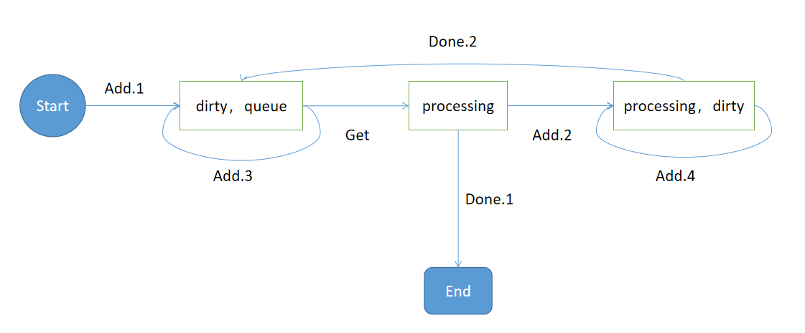
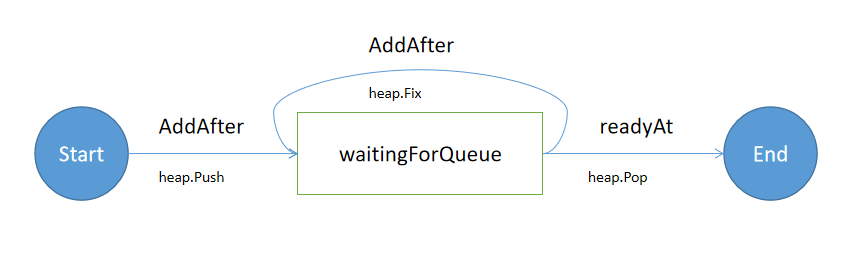

# WorkQueue

WorkQueue工作队列，源码在k8s.io/client-go/util/workqueue包中。

一般其会作用在这样的场景中：
1. SharedIndexInformer通过ListerWatcher机制从apiserver中不断获取资源对象实例的变化(delta);
2. 注册到SharedIndexInformer的EventHandler将delta或delta 的key（下文统一称呼为item）存入到WorkQueue（具体是RateLimitingQueue）
3. Controller/Operator的多个Worker线程不断从WorkQueue获取item，进行处理（对集群调谐）

可见WorkQueue起到了承接Informer（生产者）和Worker（消费者）的作用，而client-go中实现的WorkQueue具体特点有啥，`k8s.io/client-go/util/workqueue/doc.go`归纳了基础的4点。

```
//  * Fair: items processed in the order in which they are added.
//  * Stingy: a single item will not be processed multiple times concurrently,
//      and if an item is added multiple times before it can be processed, it
//      will only be processed once.
//  * Multiple consumers and producers. In particular, it is allowed for an
//      item to be reenqueued while it is being processed.
//  * Shutdown notifications.
```

1. 公平。保证处理顺序，先来先处理
2. 同一个item不能同时被多次处理；只要item还没被处理，那么多次地添加，最终也只处理一次
3. 多生产者多消费者，支持并发，WorkQueue本身也是线程安全的。同时支持item在处理后可以选择放回队列
4. 关闭时有通知

实际上，最被广泛使用的WorkQueue的实现还带有限流功能。

那client-go究竟是如何实现功能这么丰富的工作队列的呢？

答案是逐级实现：Queue（普通队列）-> DelayingQueue（延迟队列）-> RateLimitingQueue（限流队列）

本文基于[release-1.18分支](https://github.com/kubernetes/client-go/tree/release-1.18)进行分析。

## 普通队列——Queue

普通队列，实现了前文提到的WorkQueue的4点基础功能。

### Interface

接口是`Interface`。

```golang
type Interface interface {
	Add(item interface{})
	Len() int
	Get() (item interface{}, shutdown bool)
	Done(item interface{})
	ShutDown()
	ShuttingDown() bool
}
```

1. `Add` 往队列中添加item
2. `Len` 队列中当前可处理的item数量
3. `Get` 从队列中获取可处理的item（阻塞地等待到有可处理的item或队列被关闭）
4. `Done` 处理完毕item，从队列中移除该item（常用的套路是，先Get获取item，进行处理，然后主动调用Done；如没有调用Done就结束处理逻辑，则会出现逻辑错误，该item将永远不会被处理到）
5. `ShutDown` 关闭队列
6. `ShuttingDown` 判断队列是否被关闭

### Type

实现`Interface`的结构体是`Type`

```golang
type Type struct {
	queue []t
	dirty set
	processing set
	cond *sync.Cond
	shuttingDown bool
	metrics queueMetrics
	unfinishedWorkUpdatePeriod time.Duration
	clock                      clock.Clock
}
```

其中核心的三个存放item的数据结构分别是queue、dirty、processing，它们三个分别表示

1. `dirty` 待处理的items
2. `queue` 可处理的items
3. `processing` 正在处理的items

### 运行分析

item在WorkQueue中的状态转换如下图所示：



#### 状态

1. `Start`: item刚从Informer中获取到，即将加入到队列中
2. `dirty,queue`: item在可处理状态，等待Worker拾取
3. `processing`: item正在被某个Worker处理中
4. `processing,dirty`: item正在被某个Worker处理，并且又有相同item加入队列中
5. `End`: item被处理完毕，队列中不存在item


#### 状态迁移

1. `Add.1`: （Informer的EventHandler）使用Add方法，尝试将item加入到队列中时，队列中没有正在处理的相同item
2. `Add.2`: （Informer的EventHandler）使用Add方法，尝试将item加入到队列中时，队列中有正在处理的相同的item，此时该item不可被处理（为了保证多个Worker不能同时对一个item进行处理）
3. `Add.3`: （Informer的EventHandler）使用Add方法，尝试将item加入到队列中时，如果此时dirty中已存在item，那么不改变item的状态（同一item只处理一次）
4. `Add.4`: 同Add.3
5. `Get`: （Worker）尝试从队列中获取一个可处理的item
6. `Done.1`: （Worker）处理完毕item时，队列中没有待处理的相同item
7. `Done.2`: （Worker）处理完毕item时，队列中有待处理的相同item，则该待处理的item进入可处理状态

## 延迟队列——DelayingQueue

延迟队列，相较于普通的Queue，多了一个功能：添加item，一段时间后该item才会处于可处理状态。这个功能是为下文限流队列的实现做铺垫。

### DelayingInterface

接口是`DelayingInterface`。

```golang
type DelayingInterface interface {
	Interface
	AddAfter(item interface{}, duration time.Duration)
}
```

相较于Interface，仅仅多了AddAfter一个方法。

### delayingType

实现`DelayingInterface`的结构体是`delayingType`

```golang
type delayingType struct {
	Interface
	clock clock.Clock
	stopCh chan struct{}
	stopOnce sync.Once
	heartbeat clock.Ticker
	waitingForAddCh chan *waitFor
	metrics retryMetrics
}

type waitFor struct {
	data    t
	readyAt time.Time
	index int
}
```

实现延迟的关键点在waitFor这个结构体。

### 运行分析

使用`AddAfter`加入item，实际上是添加一项带就绪时间的waitFor到waitingForAddCh这个通道。随后waitingLoop()协程不断从waitingForAddCh中取出waitFor，插入到一个堆（waitForPriorityQueue）中。

堆的根存放的是持有最近`readyAt`时间的waitFor。waitingLoop()等待根上的item就绪，然后将其放入待处理队列中。



## 限流队列——RateLimitingQueue

限流队列，其实现依赖于DelayingQueue，考虑到Worker的处理能力有限，使用限流器对item加入队列的速度进行限制。

### RateLimitingInterface

```golang
type RateLimitingInterface interface {
	DelayingInterface
	AddRateLimited(item interface{})
	Forget(item interface{})
	NumRequeues(item interface{}) int
}
```

1. `AddRateLimited`: 借助限流器，添加的item在等待限流器设置的一段时间后才进入可处理状态
2. `Forget`: （限流器中可能会记录item的尝试处理次数）从限流器中删除item
3. `NumRequeues`: item重新入队（尝试处理、失败）的次数

### rateLimitingType

```golang
type rateLimitingType struct {
	DelayingInterface
	rateLimiter RateLimiter
}

func (q *rateLimitingType) AddRateLimited(item interface{}) {
	q.DelayingInterface.AddAfter(item, q.rateLimiter.When(item))
}

func (q *rateLimitingType) NumRequeues(item interface{}) int {
	return q.rateLimiter.NumRequeues(item)
}

func (q *rateLimitingType) Forget(item interface{}) {
	q.rateLimiter.Forget(item)
}
```

这块代码很简洁，具体的逻辑都由rateLimiter进行实现。


### RateLimiter

```golang
type RateLimiter interface {
	When(item interface{}) time.Duration
	Forget(item interface{})
	NumRequeues(item interface{}) int
}
```

1. `When`: item等待多久才能进入待处理状态
2. `Forget`: （限流器中可能会记录item的尝试处理次数）从限流器中删除item
3. `NumRequeues`': item重新入队的次数

#### BucketRateLimiter

```golang
type BucketRateLimiter struct {
	*rate.Limiter
}
```

该限流器使用令牌桶算法（设定令牌生成的速率和令牌桶容量）限制item加入的速率，其`NumRequeues`/`Forget`不做任何处理。

#### ItemBucketRateLimiter

```golang
type ItemBucketRateLimiter struct {
	r     rate.Limit
	burst int

	limitersLock sync.Mutex
	limiters     map[interface{}]*rate.Limiter
}
```

升级版的`BucketRateLimiter`，它对每一个item设置一个令牌桶限流，`NumRequeues`/`Forget`不做任何处理。

#### ItemExponentialFailureRateLimiter

```golang
type ItemExponentialFailureRateLimiter struct {
	failuresLock sync.Mutex
	failures     map[interface{}]int

	baseDelay time.Duration
	maxDelay  time.Duration
}
```

`ItemExponentialFailureRateLimiter`针对每个item记录失败次数和设置限流器，限流策略是：等待时间随失败次数（重入队次数）指数增长，直到抵达阈值。`NumRequeues`返回失败次数，`Forget`重置其失败次数。

#### ItemFastSlowRateLimiter

```golang
type ItemFastSlowRateLimiter struct {
	failuresLock sync.Mutex
	failures     map[interface{}]int

	maxFastAttempts int
	fastDelay       time.Duration
	slowDelay       time.Duration
}
```

`ItemFastSlowRateLimiter`也是针对每个item记录失败次数和设置限流器，限流策略是：在一定失败次数内，等待时间是fastDelay，否则是slowDelay。`NumRequeues`返回失败（重入队）次数，`Forget`重置其失败次数。

#### MaxOfRateLimiter

```golang
type MaxOfRateLimiter struct {
	limiters []RateLimiter
}
```

`MaxOfRateLimiter`是一种特殊限流器，是其他限流器的组合（可放入任意限流器）。其等待时间和失败次数，取其成员中的最大等待时间和最大失败次数，`Forget`则重置所有成员限流器的失败次数。

Controller默认使用的就是这种组合限流器。

```golang
func DefaultControllerRateLimiter() RateLimiter {
	return NewMaxOfRateLimiter(
		NewItemExponentialFailureRateLimiter(5*time.Millisecond, 1000*time.Second),
		// 10 qps, 100 bucket size.  This is only for retry speed and its only the overall factor (not per item)
		&BucketRateLimiter{Limiter: rate.NewLimiter(rate.Limit(10), 100)},
	)
}
```

### 限流队列的一般用法

下面写一个简单例子，示意限流队列的用法。

```golang
func (ct *controller) processNextWorkItem() bool {
    item, quit := ct.queue.Get() // 尝试从队列中获取item
    if quit {   // 队列关闭则不再做任何处理
        return false
    }
    err := ct.syncHandler(item) // 根据item进行调谐
    if err == nil {
        ct.queue.Forget(item)    // 处理完毕，则从限流器中删除该item
    }
    ct.queue.AddRateLimited(item)   // 将该item重新加入队列
    return true
}
```